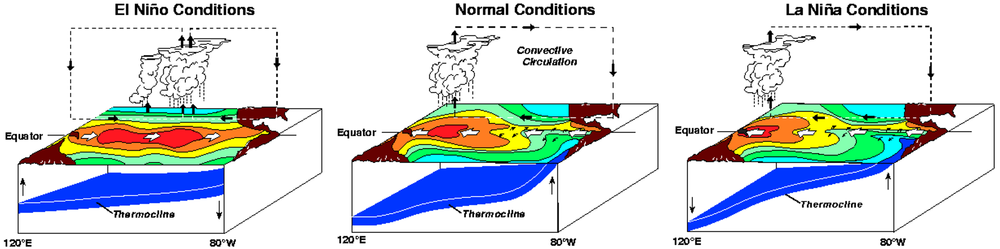
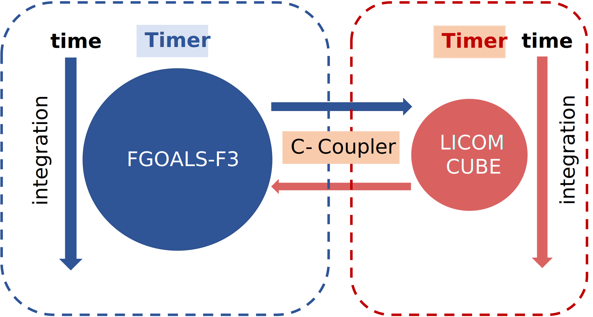
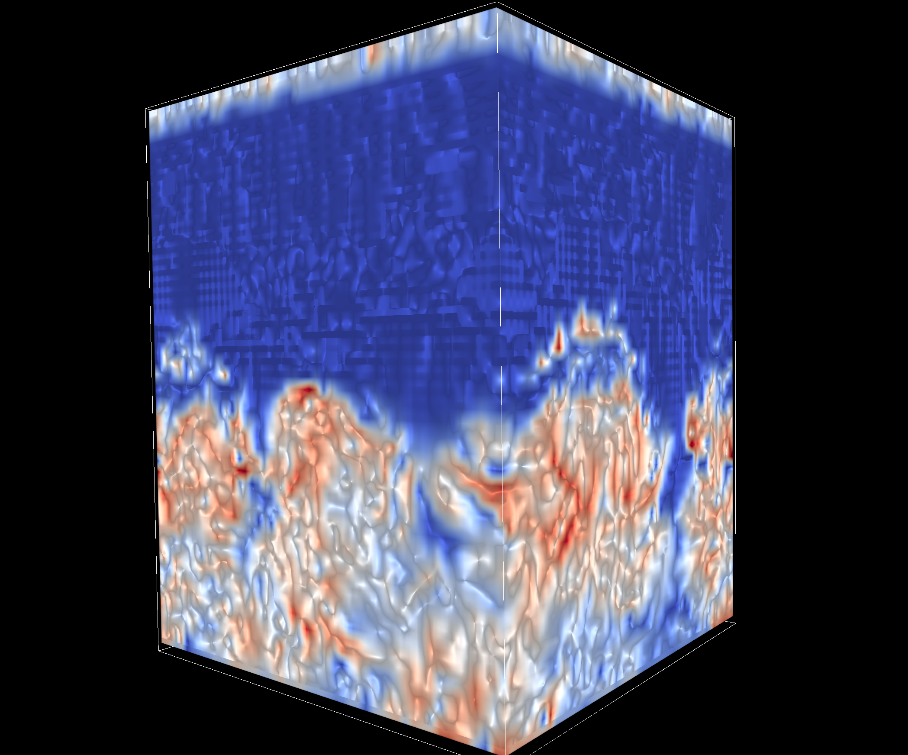

## Research Interests

- Ocean dynamics and climate variability

  
  <figcaption class="caption">
    Surface temperatures, winds, areas of rising air, and the thermocline in the tropical Pacific during El Niño, normal, and La Niña conditions. Source: NOAA/PMEL/TAO Project Office
  </figcaption>

- Ocean modeling and vertical mixing parameterization

  
  <figcaption class="caption">
    Fully-Coupled Climate Model (FGOALS-f3) interacting with LICOM-CUBE through the C-Coupler coupling toolkit developed by Tsinghua University
  </figcaption>

- Subgrid-scale parameterization development
- Multiscale ocean–atmosphere interactions

- Turbulent Simulation (Large Eddy Simulation, LES)

  
  <figcaption class="caption">
    Internal wave striking the bottom boundary and breaking, leading to an uneven distribution of kinetic energy. Simulated using the PALM large eddy simulation (LES) model
  </figcaption>

## Hobbies

- Running
- Hiking
- Self-driving
- Music

