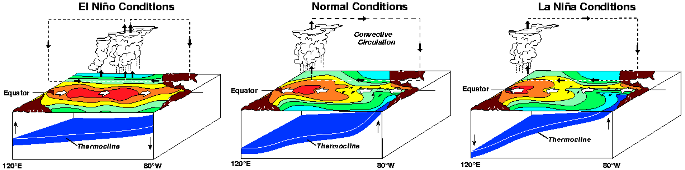

## Research Interests
- Air-sea interaction (Especially El Nino/Southern Oscillation, ENSO)

  
  <figcaption class="caption">
    This diagram shows a model of surface temperatures, winds, areas of rising air, and the thermocline (blue surface) in the tropical Pacific during El Niño, normal, and La Niña conditions. Click to enlarge. Source: NOAA/PMEL/TAO Project Office, Dr. Michael J. McPhaden, Director
  </figcaption>

- Ocean modeling and Coupled climate modeling

  
  <figcaption class="caption">
    This diagrams illustrates how the Fully-Coupled Climate Model (Fgoals-f3) interacts with LICOM-CUBE through coupling toolkit-C-Coupler developed by Tsinghua University.
  </figcaption>

- Turbulent Simulation (Large Eddy Simulation, LES)

  
  <figcaption class="caption">
    This diagram illustrates an internal wave striking the bottom boundary and breaking, leading to an uneven distribution of kinetic energy. The case is simulated using the PALM large eddy simulation (LES) model.
  </figcaption>

## Hobbies
- Running
- Hiking
- Self-driving
- Music