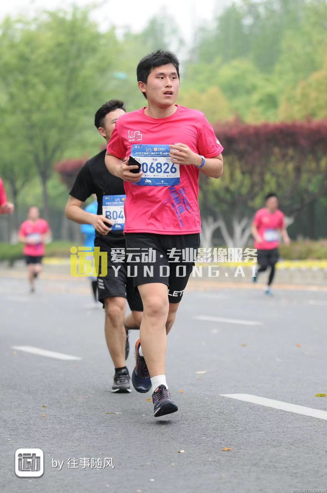

Welcome to my homepage!

At the beginning
======
I don't get used to show myself to other people. Like running, what I have to do is to keep breathing silent, matain comfortable pace and endure the continoues pressure from mental, finally letting me run much longer and faster than I used to be. The picture below depicts the moment when I challenged myself with half-marathon race. And I'm preparing for another half-marathon race. But here I am! To arrange my current situation and fight for the future long-lasting marathon-like career, I sincerely put down my recent work and other things  concerning with myself in this website.

  
  <figcaption class="caption">
    Photo was taken when Jin Li participated his First Marathon  
    Race in Nanjing, China
  </figcaption>

Describe in Short
======
Jin Li is now persuing his Doctor degree of meterology in Institute of Atmospheric Physics, University of Chinese Academy of Sciences. He was supervised by Prof. Yongqiang Yu. His research interests include the ocean modeling combaining with artificial intelligence methods and interaction between atmosphere and ocean, whose target is to improve the fedelity of ocean simulation. Recently, he fucoses on the programs showing below:
* Use Large Eddy Simulation to improve the data-driven vertical mixing scheme
* Construct the coupling interface of the New Generation ocean circulation model LICOM (LICOM-CUBE)

More detailed information of these pragram are listed in Portfolio.
