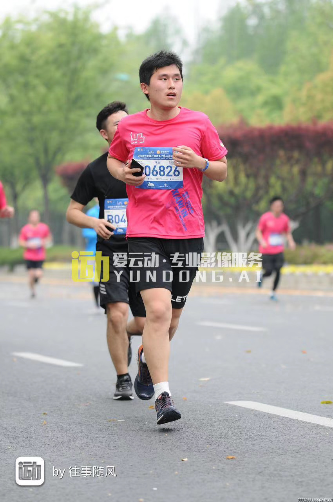

Welcome to my homepage!

## At the beginning

Like running, what I have to do is to keep breathing silent, maintain comfortable pace and endure the continuous pressure from mental, finally letting me run much longer and faster than I used to be. The picture below depicts the moment when I challenged myself with half-marathon race. And I'm preparing for another half-marathon race. But here I am! To arrange my current situation and fight for the future long-lasting marathon-like career, I sincerely put down my recent work and other things concerning myself in my homepage.

  
  <figcaption class="caption">
    Photo was taken when Jin Li participated his First Marathon  
    Race in Nanjing, China
  </figcaption>

## Research Profile

Jin Li is a Ph.D. candidate in Meteorology at the Institute of Atmospheric Physics (IAP), Chinese Academy of Sciences (CAS), supervised by Prof. Yongqiang Yu. His research focuses on **climate dynamics and ocean modeling**, with emphasis on ENSO variability, subsurface ocean processes, and physically informed machine-learning parameterizations. He integrates climate simulations and large-eddy simulations (LES) to improve the representation of subgrid-scale ocean mixing and its impact on climate variability.

He is broadly interested in multiscale interactions across the Earth system and interdisciplinary approaches combining physical understanding with data-driven modeling.

## Education

- **Ph.D. in Meteorology** (Expected June 2026)  
  Institute of Atmospheric Physics, Chinese Academy of Sciences, Beijing, China  
  Advisor: Prof. Yongqiang Yu

- **B.S. in Atmospheric Sciences** (2021)  
  Nanjing University of Information Science and Technology (NUIST), Nanjing, China  
  Advisor: Prof. Xiaolei Zou

## Current Research

- Using Large Eddy Simulation (LES) to develop physics-informed vertical mixing parameterizations
- Online evaluation of learned mixing schemes in LICOM3.0 ocean model
- ENSO asymmetry and the role of ocean zonal currents in OMIP2 simulations
